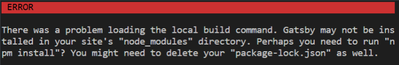

# Gatsby, Netlify 로 블로그 시작하기(1)

## Gatsby란?

배포와 동시에 정적페이지를 만들기 때문에 웹서버가 필요없는 node.js에서 파생된 프레임워크

## 1. 환경설정

먼저 node.js를 설치해주고 Gatsby를 설치해준다.

### node 설치

https://nodejs.org/en/

위 링크에서`node.js`를 설치해주고 잘 설치 되었는지 아래와 같이 버전을 확인해준다.

```
PS C:\Users\A0501660> node --version
v12.18.2
```

<br/>

### Gatsby 설치

gatsby를 설치해준다. `-g`는 global 옵션으로 설치된 패키지를 전역에서 참조할 수 있게 만들어준다. 전역으로 설치한 경우, Windows 는 아래 경로에서 확인 가능하다. 

c:\Users\%USERNAME%\AppData\Roaming\npm\node_modules 

```
npm install -g gatsby-cli
```

<br/>

## 2. 프로젝트 생성하기

### default 블로그 생성하기

다음과 같이 간단하게 만들 수 있다.

```sh
$ gatsby new [블로그이름]
```

### 	Gatsby 스타터팩으로 시작하기

https://www.gatsbyjs.com/starters/

위 링크에서 본인이 원하는 블로그 또는 정적사이트 스타터팩을 골라 빠르게 시작할 수 있다.

원하는 팩을 골랐다면, 아래 명령어로 프로젝트를 만들어준다. 설치 명령어는 팩 안에 적혀있다.

```sh
$ gatsby new [본인이 원하는 폴더 이름] [git 주소]
$ gatsby new gatsby-starter-blog https://github.com/gatsbyjs/gatsby-starter-blog # 예시, 가장 대표적인 gatsby 스타터팩
```

### github에서 clone 해서 실행하기

```

```

## 3. 실행

만들어진 디렉토리에서 아래 명령어를 실행한다.

```sh
$ gatsby build
```

github에서 클론 후 아래와 같이 에러가 뜬다면,



말 그대로 npm install을 해주면 된다. 디펜던시의 모듈들을 먼저 설치해줘야하기 때문에 생긴 에러이다.

```sh
$ npm install
```

